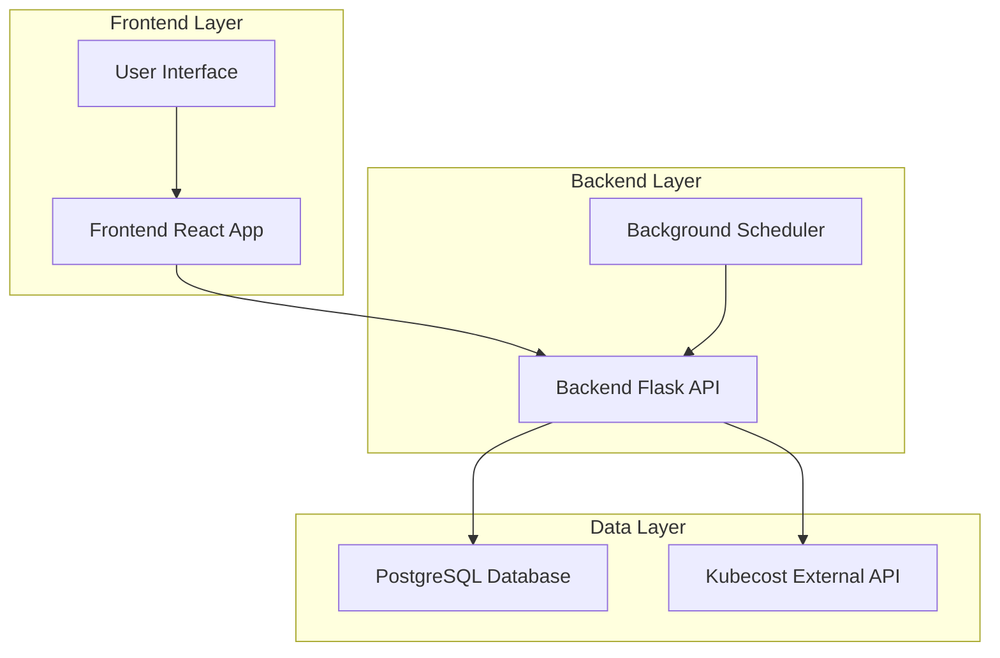
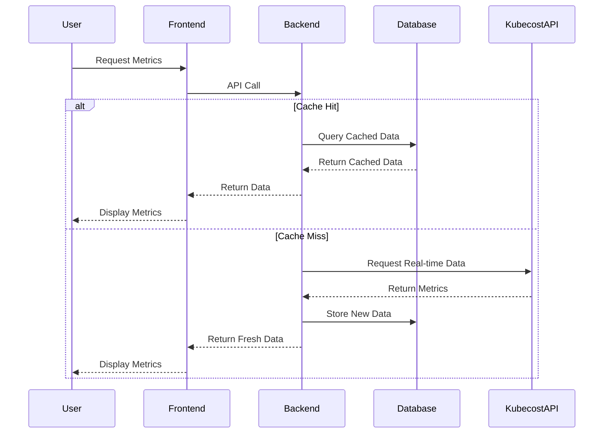
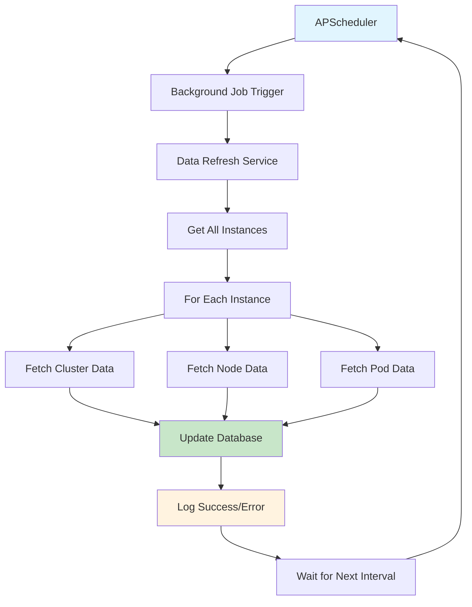
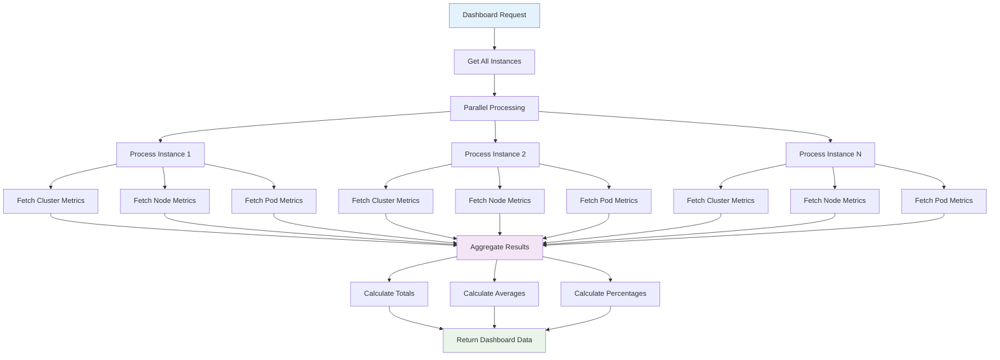
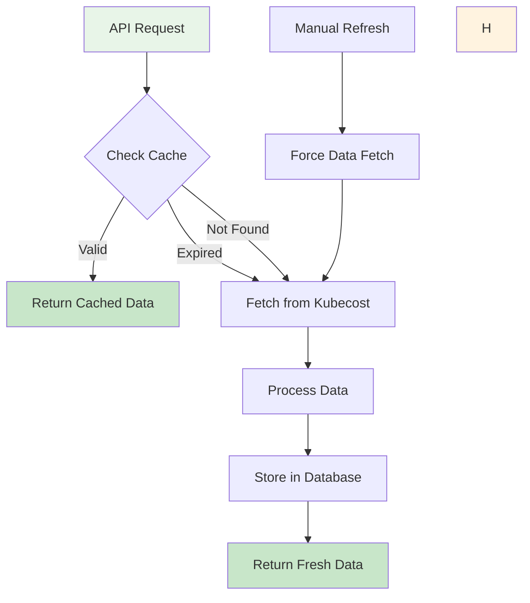
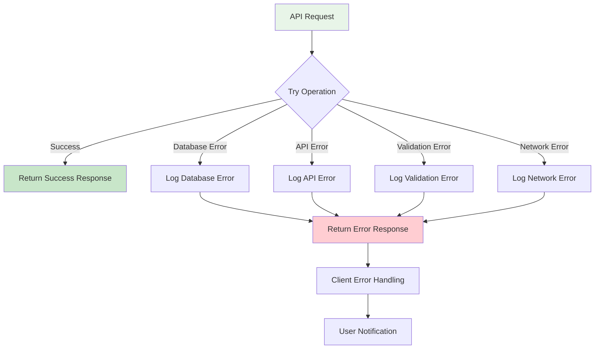
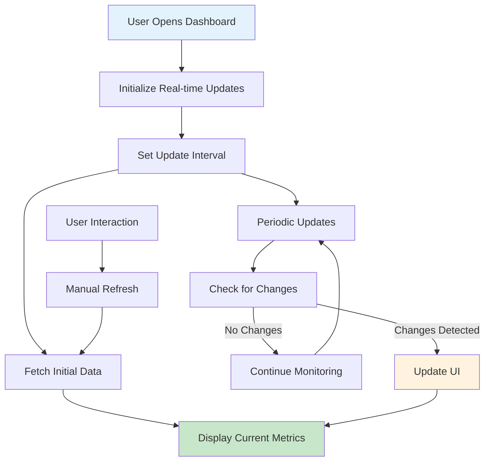
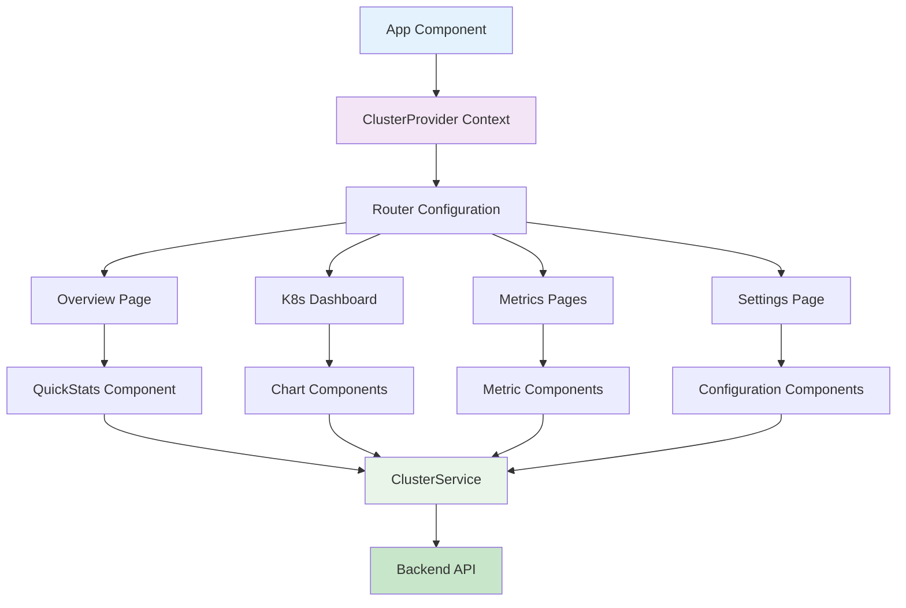

# Kubernetes Monitoring Module - Flow Diagrams

## 1. System Overview Flow

## 2. Data Collection Flow

## 3. Background Data Refresh Flow (not enabled)

## 4. Dashboard Data Aggregation Flow

## 5. Cache Management Flow

## 6. Error Handling Flow

## 7. Real-time Monitoring Flow

## 8. Data Processing Pipeline

```mermaid
graph LR
    A[Raw Kubecost Data] --> B[Data Validation]
    B --> C[Data Transformation]
    C --> D[Business Logic Processing]
    D --> E[Data Aggregation]
    E --> F[Database Storage]
    F --> G[Cache Update]
    G --> H[Response Generation]

    style A fill:#e3f2fd
    style D fill:#f3e5f5
    style F fill:#e8f5e8
    style H fill:#c8e6c9
```

## 9. Component Interaction Flow

## Key Flow Characteristics

### 1. **Asynchronous Processing** (not enabled)

- Background data refresh with configurable intervals
- Parallel processing of multiple instances
- Non-blocking API responses

### 2. **Caching Strategy**

- Multi-level caching (Database + Application)
- Hash-based cache key generation

### 3. **Error Resilience**

- Comprehensive error handling at each layer
- Graceful degradation for failed components
- Retry mechanisms for transient failures

### 4. **Real-time Updates**

- Periodic data refresh
- Change detection and UI updates
- User-triggered manual refresh

### 5. **Scalability Features**

- Stateless backend services
- Database connection pooling
